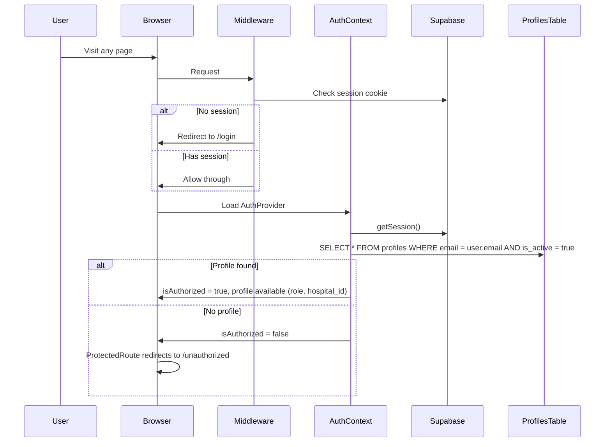

# Improve Authentication and Authorization

## Current Problems

The auth code has several issues that this plan will fix:

1. **Hardcoded email allowlist** -- Authorization is controlled by 5 emails hardcoded in [context/auth-context.tsx](context/auth-context.tsx) (lines 27-33). This is fragile, visible in the JS bundle, and duplicates the `profiles` table that already exists in the database.
2. **Deprecated package** -- The auth callback uses `@supabase/auth-helpers-nextjs` which is deprecated. The modern replacement is `@supabase/ssr`.
3. **No server-side protection** -- There is no `middleware.ts`. All route protection is client-side only (via `ProtectedRoute`), meaning anyone can access route HTML/JS before the redirect fires.
4. **Profile data not available in the app** -- The `profiles` table has a `role` column (Admin, Doctor, Vet Tech) and `hospital_id`, but neither is exposed to the frontend. Only the Edge Function uses them.

## Database Schema (already exists, no changes needed)

The `profiles` table is already well-structured:

```
profiles
  id          uuid       PK, FK -> auth.users.id
  hospital_id bigint     FK -> hospitals.id
  email       text
  role        text       default 'Vet Tech'  (values: Admin, Doctor, Vet Tech)
  is_active   boolean    default true
  created_at  timestamptz
```

RLS policy already exists: `select own hospital mapping by email` -- authenticated users can only read their own profile row (where email matches JWT email).

## Plan

### Step 1: Migrate from deprecated `@supabase/auth-helpers-nextjs` to `@supabase/ssr`

Create two Supabase client utilities following the official `@supabase/ssr` pattern:

- `**utils/supabase/client.ts**` -- Browser client (replaces the current `utils/supabase.ts` singleton for auth). Uses `createBrowserClient` from `@supabase/ssr`.
- `**utils/supabase/server.ts**` -- Server client for use in middleware and server components. Uses `createServerClient` from `@supabase/ssr` with cookie handling.

Update [package.json](package.json): add `@supabase/ssr`, remove `@supabase/auth-helpers-nextjs`.

Keep the existing `utils/supabase.ts` for now (it's used for data queries in grids), but move auth operations to the new clients.

### Step 2: Add `Profile` type and update auth context types

Add a `Profile` type to `utils/supabase/client.ts`:

```typescript
export type Profile = {
    id: string;
    hospital_id: number;
    email: string;
    role: 'Admin' | 'Doctor' | 'Vet Tech';
    is_active: boolean;
    created_at: string;
};
```

Update `AuthContextType` in [context/auth-context.tsx](context/auth-context.tsx) to include:

```typescript
type AuthContextType = {
    user: User | null;
    session: Session | null;
    profile: Profile | null; // NEW: the user's profile from DB
    isLoading: boolean;
    isAuthorized: boolean; // now driven by profiles table
    signInWithGoogle: () => Promise<void>;
    signOut: () => Promise<void>;
};
```

### Step 3: Replace hardcoded email list with `profiles` table query

In [context/auth-context.tsx](context/auth-context.tsx), after session is loaded, query the `profiles` table:

```typescript
// Fetch the user's profile from the profiles table.
// A user is authorized if they have an active profile row.
const { data: profile } = await supabase
    .from('profiles')
    .select('*')
    .eq('email', session.user.email)
    .eq('is_active', true)
    .single();

setProfile(profile);
```

`isAuthorized` becomes: `profile !== null` (i.e., user has an active row in `profiles`).

This completely removes the hardcoded email list. Adding/removing users is now done by inserting/deactivating rows in the `profiles` table.

### Step 4: Add Next.js middleware for server-side route protection

Create a new `middleware.ts` at the project root. This runs on the server before page rendering:

```
middleware.ts
  - Reads session from cookies using @supabase/ssr server client
  - If no session and path is not /login, /auth/callback, /unauthorized, /privacy-policy, /terms -> redirect to /login
  - If session exists and path is /login -> redirect to /
  - Passes through all other requests
```

Config matcher excludes static files, images, and API routes.

### Step 5: Update the auth callback route

Replace the deprecated `createRouteHandlerClient` in [app/auth/callback/route.ts](app/auth/callback/route.ts) with the new `@supabase/ssr` server client.

### Step 6: Add comments to all auth files

Add clear, non-obvious comments to help developers understand the auth flow:

- `**utils/supabase/client.ts**` -- Explain when to use browser vs server client
- `**utils/supabase/server.ts**` -- Explain cookie handling for SSR
- `**middleware.ts**` -- Explain the public vs protected route split and why server-side checks matter
- `**context/auth-context.tsx**` -- Explain the profile-based authorization model and the relationship between `profiles` table and `isAuthorized`
- `**components/protected-route.tsx**` -- Explain this is a client-side fallback guard, with middleware being the primary protection
- `**app/auth/callback/route.ts**` -- Explain the OAuth PKCE flow

## Auth Flow After Changes



## Files Changed Summary

- **New**: `utils/supabase/client.ts`, `utils/supabase/server.ts`, `middleware.ts`
- **Modified**: [context/auth-context.tsx](context/auth-context.tsx), [app/auth/callback/route.ts](app/auth/callback/route.ts), [components/protected-route.tsx](components/protected-route.tsx), [package.json](package.json)
- **Unchanged**: [supabase/functions/get-hospital/index.ts](supabase/functions/get-hospital/index.ts) (already uses profiles correctly), [components/header.tsx](components/header.tsx), all page files, database schema
